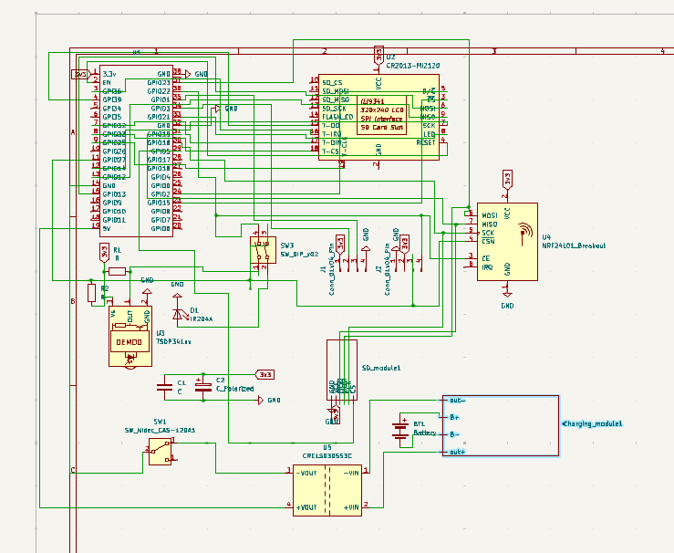

# This is my journal where i will write my journy building this device.
## 5/7/2025 july
I searched about ESP32 and knew a lot about ESP32 mardauder and another software that i can use and found a schematic that i can use as a refrence. and made the schematic and slept on the laptop 🥲👍. and learned about nRFID and 2.2ghz signals and how they work. and learned about the IR. and i am very exited to copy my TV's remote signal and emitte it with the device again.  
### The schematic:  
    

Time : 9 hours 

## 6/7/2025 july
Collected all the 3d models to add it into onshape so i can make my case.  
and i finished the case and the project is all ready i guess i need only to collect the BOM and calculate it.  
 ### the final case:
 

